# Open-Source Simulators for Off-Road Ground Robotics in Reinforcement Learning

A visual companion to the survey *"Open-Source Simulators for Off-Road Ground Robotics in
Reinforcement Learning: A Survey and Comparative Analysis"* (Trescher, Bienemann, Steinecker,
Luettel, Maehlisch). Each entry below shows a real screenshot of the simulator's own simulated
environment, exactly where that image came from (with its copyright holder and license), and the
simulator's own license — a quick visual index into the 22 simulators evaluated in the paper's
shared criteria table. For the full methodology, per-criterion scoring, and citations, see the paper
itself.

## Conventional Simulators

### CARLA
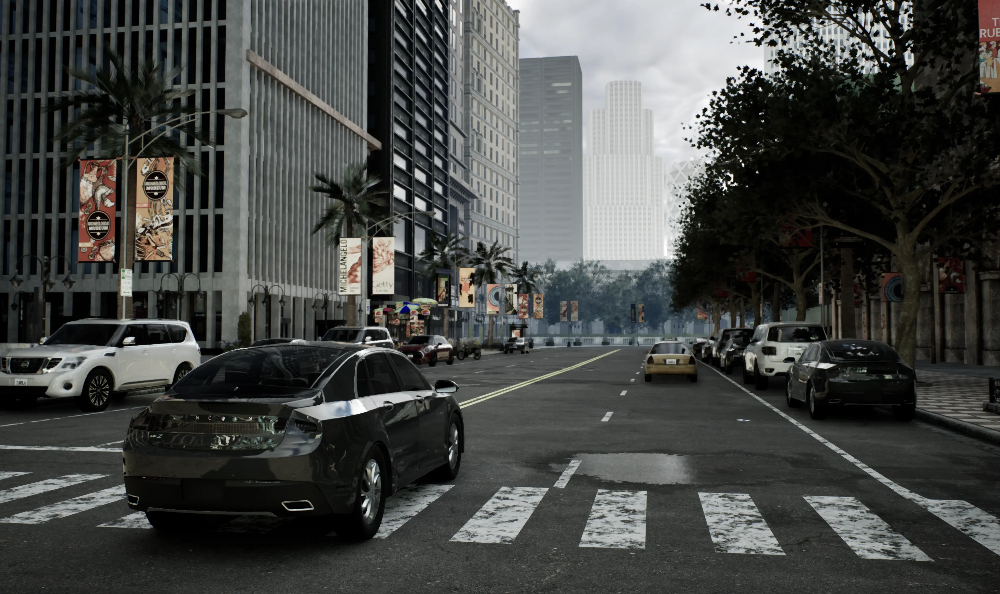

*Image source: [carla_ue5_readme_img.webp](https://raw.githubusercontent.com/carla-simulator/carla/ue5-dev/Docs/img/carla_ue5_readme_img.webp), from CARLA's own README (`ue5-dev` branch, its current default) — © 2024 Computer Vision Center (CVC), Universitat Autònoma de Barcelona, [MIT](third_party_licenses/MIT.txt)*

An open-source urban driving simulator built on Unreal Engine, with rich sensor suites (camera,
LIDAR, radar) and configurable towns, weather, and traffic.  
Citation: Dosovitskiy et al., "CARLA: An Open Urban Driving Simulator," CoRL 2017
Simulator license: MIT (assets CC-BY)

### DeepDrive
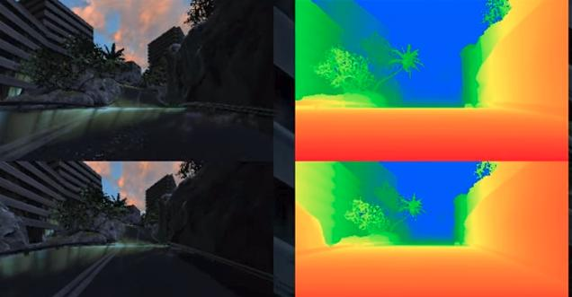

*Image source: [cam-depth3.jpg](https://deepdrive.io/assets/img/cam-depth3.jpg), from the deepdrive.io homepage (the GitHub repo itself ships no environment screenshots) — © Deepdrive, Inc.*

An early Unreal-Engine-based driving simulator with camera/depth sensing and a small set of preset
maps and scenarios; no longer actively maintained.  
Citation: Craig Quiter, "DeepDrive," 2017 — [github.com/deepdrive/deepdrive](https://github.com/deepdrive/deepdrive)
Simulator license: MIT

### MetaDrive
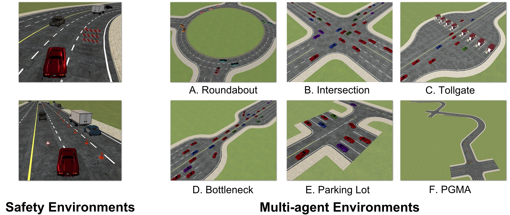

*Image source: [metadrive-envs.jpg](https://raw.githubusercontent.com/metadriverse/metadrive/main/documentation/source/figs/metadrive-envs.jpg), from the repo's docs figures (not shown in the top-level README) — © MetaDrive Team, [Apache-2.0](third_party_licenses/Apache-2.0.txt)*

A lightweight, procedurally-generated driving simulator built for scalable, generalizable RL
research, with real-world log replay and multi-agent support.
Citation: Li et al., "MetaDrive: Composing Diverse Driving Scenarios for Generalizable Reinforcement
Learning," IEEE T-PAMI 2023 — [github.com/metadriverse/metadrive](https://github.com/metadriverse/metadrive)
Simulator license: Apache-2.0

### highway-env
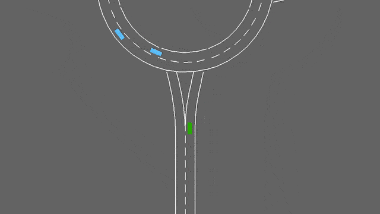

*Image source: [roundabout-env.gif](https://highway-env.farama.org/main/_static/animations/environments/roundabout-env.gif), linked from HighwayEnv's own README (environments table) — © 2018 Edouard Leurent, © 2023 Farama Foundation, [MIT](third_party_licenses/MIT.txt)*

A fast, configurable family of top-down highway driving environments (highway, merge, roundabout,
intersection, parking) built on Gymnasium.
Citation: Leurent, "An Environment for Autonomous Driving Decision-Making," 2018
Simulator license: MIT

### LimSim
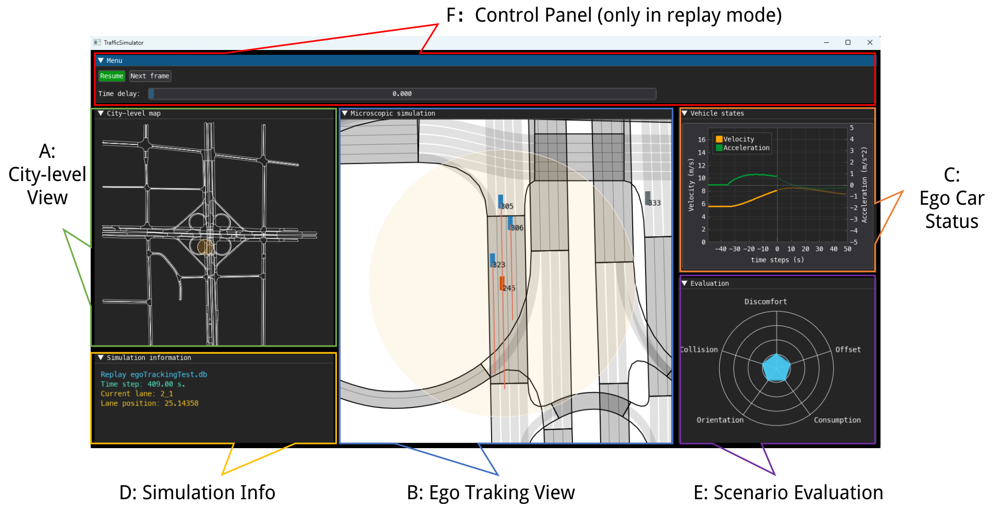

*Image source: [limsim_gui.png](https://raw.githubusercontent.com/PJLab-ADG/LimSim/master/assets/limsim_gui.png), from LimSim's own readme.md (GUI section) — © PJLab-ADG, [GPL-3.0](third_party_licenses/GPL-3.0.txt)*

A long-term, multi-scenario traffic simulator built on SUMO, combining an MCTS-based decision maker
with realistic background traffic for extended driving scenarios.
Citation: Wen et al., "LimSim: A Long-Term Interactive Multi-Scenario Traffic Simulator," IEEE ITSC
2023
Simulator license: GPL-3.0

### TORCS
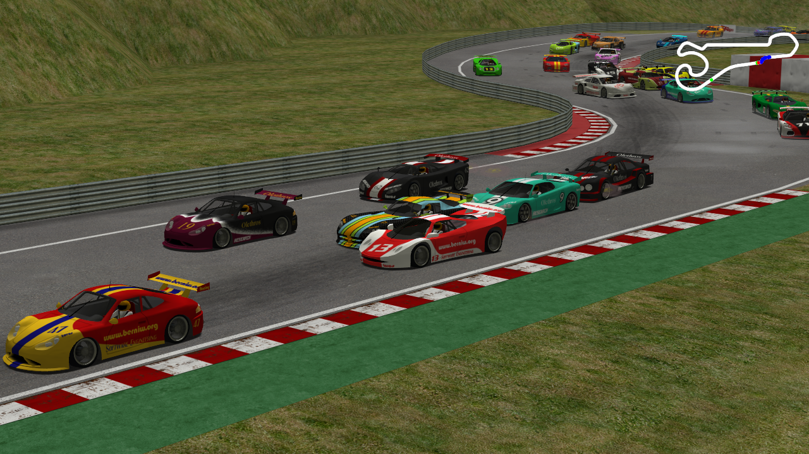

*Image source: [torcs-20121025123603.png](https://a.fsdn.com/con/app/proj/torcs/screenshots/torcs-20121025123603.png), from the [SourceForge project screenshot gallery](https://sourceforge.net/projects/torcs/) (dated 2012-10-25 — the newest one available; the gallery hasn't been updated since) — © The TORCS Team, [GPL-2.0](third_party_licenses/GPL-2.0.txt)*

A classic open-source 3D racing car simulator with a long history in reinforcement learning and
control research.
Citation: Wymann et al., "TORCS: The Open Racing Car Simulator," 2014 — [torcs.sourceforge.net](http://www.torcs.org)
Simulator license: GPLv2

### Gazebo
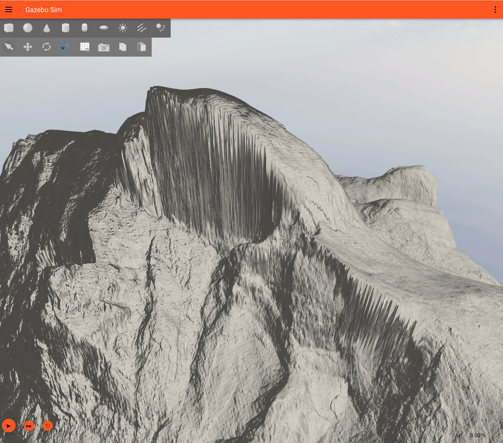

*Image source: [gazebo_half_dome.png](https://raw.githubusercontent.com/gazebosim/gz-sim/main/tutorials/files/digital_elevation_models/gazebo_half_dome.png), from gz-sim's [digital-elevation-model tutorial](https://github.com/gazebosim/gz-sim/blob/main/tutorials/digital_elevation_models.md) (not shown in the top-level README) — © Open Source Robotics Foundation, [Apache-2.0](third_party_licenses/Apache-2.0.txt)*

A general-purpose, physics-accurate multi-robot simulator widely used across robotics research, with
pluggable physics engines and rich sensor models.
Citation: Koenig & Howard, "Design and Use Paradigms for Gazebo, an Open-Source Multi-Robot
Simulator," IEEE IROS 2004 — [github.com/gazebosim/gz-sim](https://github.com/gazebosim/gz-sim)
Simulator license: Apache-2.0

### Webots
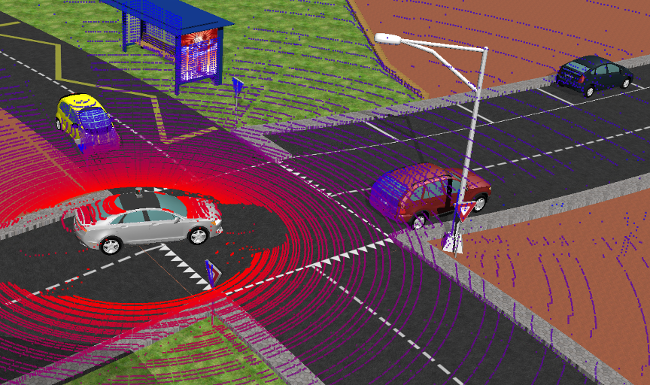

*Image source: [lidar_simulation.png](https://raw.githubusercontent.com/cyberbotics/webots/master/docs/guide/images/sensors/lidar_simulation.png), from Webots' own README ("Real Time Sensor Visualization") — © Cyberbotics Ltd., [Apache-2.0](third_party_licenses/Apache-2.0.txt)*

A general-purpose robot simulator supporting a wide range of robot types, with realistic physics and
a large built-in model library.
Citation: Michel, "Webots: Symbiosis between Virtual and Real Mobile Robots," Virtual Worlds 1998
Simulator license: Apache-2.0

### PyBullet
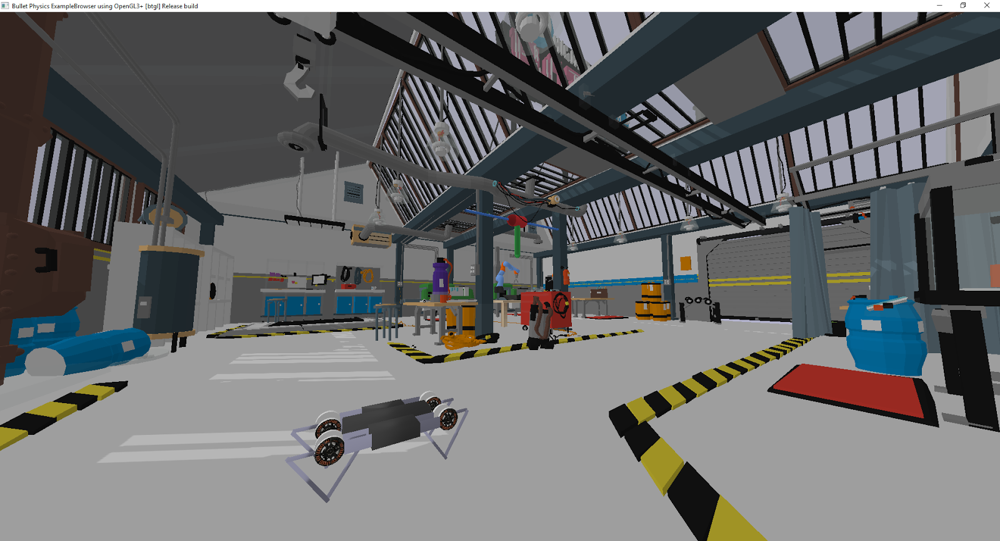

*Image source: [CoRL_VR_demo.png](https://raw.githubusercontent.com/bulletphysics/bullet3/master/docs/pybullet_quickstart_guide/images/CoRL_VR_demo.png), from bullet3's PyBullet Quickstart Guide assets (not shown in the top-level README, which only has the pybullet.org logo) — © Erwin Coumans (Bullet Physics), [zlib](third_party_licenses/zlib.txt)*

A Python-based physics simulation module built on the Bullet physics engine, popular for robotics and
RL research.
Citation: Coumans & Bai, "PyBullet, a Python Module for Physics Simulation for Games, Robotics and
Machine Learning," 2021 — [github.com/bulletphysics/bullet3](https://github.com/bulletphysics/bullet3)
Simulator license: zlib

### MuJoCo
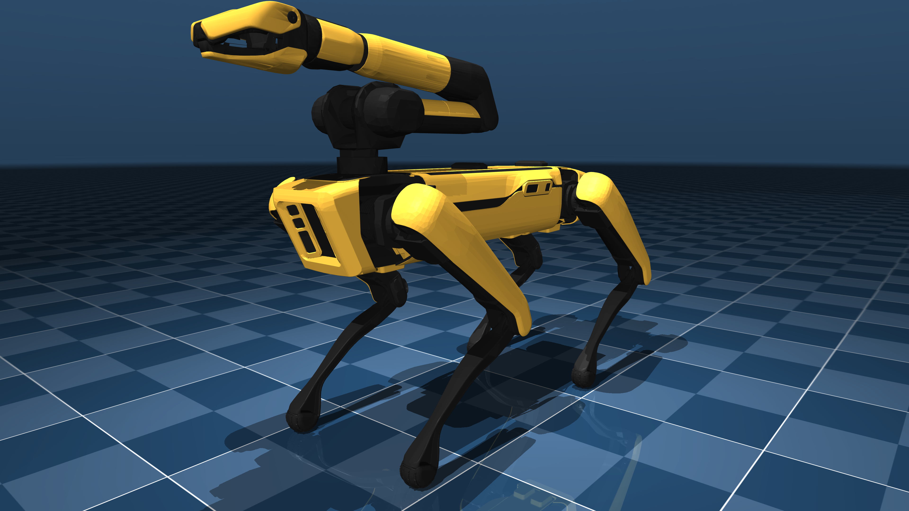

*Image source: [spot.png](https://raw.githubusercontent.com/google-deepmind/mujoco_menagerie/main/boston_dynamics_spot/spot.png) (Boston Dynamics Spot), from [MuJoCo's official model gallery](https://mujoco.readthedocs.io/en/latest/models.html) — © 2021 Clearpath Robotics Inc. / Google DeepMind (MuJoCo Menagerie), [BSD-3-Clause](third_party_licenses/BSD-3-Clause.txt)*

A fast, accurate physics engine for contact-rich robotics and control research, open-sourced and
maintained by Google DeepMind.
Citation: Todorov, Erez & Tassa, "MuJoCo: A Physics Engine for Model-Based Control," IEEE IROS 2012 — [github.com/google-deepmind/mujoco](https://github.com/google-deepmind/mujoco)
Simulator license: Apache-2.0

### Isaac Sim/Lab

*Image source: [isaaclab.jpg](https://raw.githubusercontent.com/isaac-sim/IsaacLab/main/docs/source/_static/isaaclab.jpg), from IsaacLab's own README (top banner) — © 2022–2025 The Isaac Lab Project Developers, [BSD-3-Clause](third_party_licenses/BSD-3-Clause.txt)*

NVIDIA's GPU-accelerated robotics simulation platform, built on Omniverse/PhysX, for large-scale
parallel RL training.
Citation: Makoviychuk et al., "Isaac Gym: High Performance GPU-Based Physics Simulation for Robot
Learning," 2021
Simulator license: largely open source (Omniverse Kit itself is closed-source); free for research

### Project Chrono
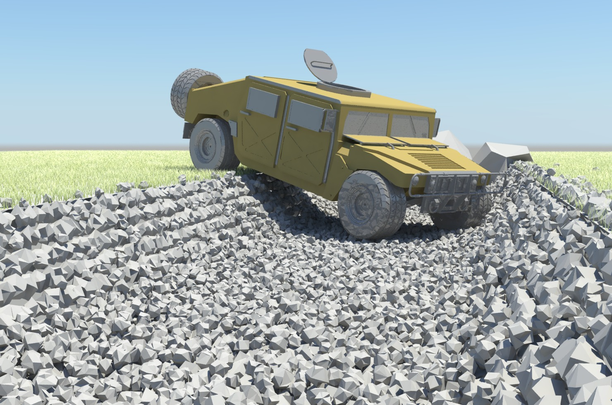

*Image source: [humvee_ditch.jpg](https://projectchrono.org/assets/Images/humvee_ditch.jpg), from the projectchrono.org homepage carousel ("Vehicle Negotiating Ditch") — © 2016 Project Chrono Development Team, [BSD-3-Clause](third_party_licenses/BSD-3-Clause.txt)*

A multi-physics simulation engine with detailed wheeled/tracked vehicle models and deformable-terrain
(soil) support.
Citation: Tasora et al., "Chrono: An Open Source Multi-physics Dynamics Engine," HPCSE 2016 — [github.com/projectchrono/chrono](https://github.com/projectchrono/chrono)
Simulator license: BSD

## Data-Driven Simulators

### Waymax
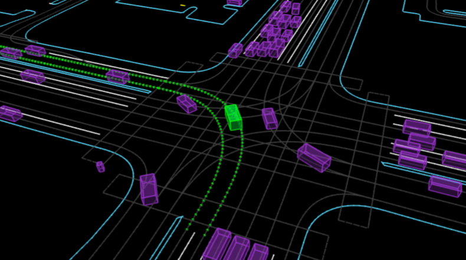

*Image source: [waymax_splash_intersection.png](https://ar5iv.labs.arxiv.org/html/2310.08710/assets/figs/waymax_splash_intersection.png), Fig. 1 of the [Waymax paper](https://arxiv.org/abs/2310.08710) (its GitHub repo ships no images at all) — © Waymo LLC*

A JAX-based, GPU/TPU-accelerated simulator that replays and reactively simulates real Waymo Open
Motion Dataset traffic scenarios.
Citation: Gulino et al., "Waymax: An Accelerated, Data-Driven Simulator for Large-Scale Autonomous
Driving Research," NeurIPS 2023 — [github.com/waymo-research/waymax](https://github.com/waymo-research/waymax)
Simulator license: non-commercial Waymax License

### GPUDrive
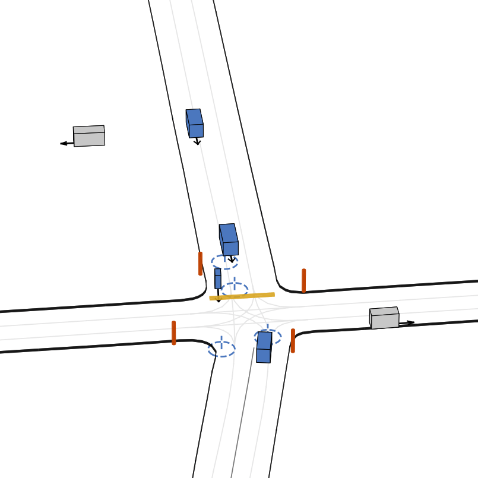

*Image source: [sim_video_7.gif](https://raw.githubusercontent.com/Emerge-Lab/gpudrive/main/assets/sim_video_7.gif), from GPUDrive's own README (demo table, "Simulator state" column) — © 2024 Kazemkhani, Pandya, Cornelisse, Shacklett & Vinitsky, [MIT](third_party_licenses/MIT.txt)*

A GPU-batched, Madrona-engine-based multi-agent driving simulator capable of running millions of
steps per second.
Citation: Kazemkhani et al., "GPUDrive: Data-driven, multi-agent driving simulation at 1 million FPS,"
ICLR 2025
Simulator license: MIT

### nuPlan
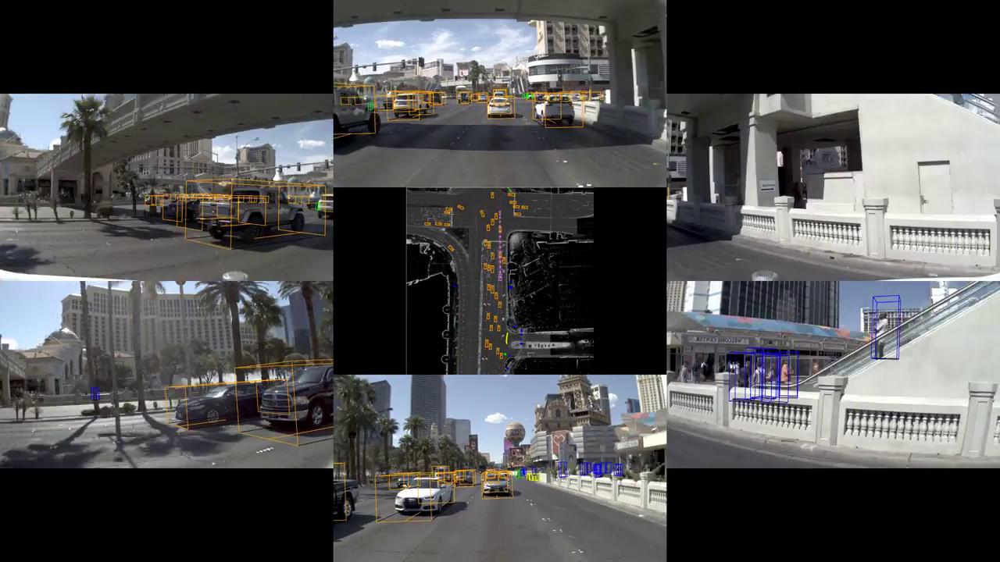

*Image source: frame at 0:04 of Motional's own ["Technically Speaking: Offline Perception"](https://www.youtube.com/watch?v=xVQPUa7tgjU&t=4s) video (nuplan-devkit's repo/docs ship no environment screenshot at all) — © Motional*

A large-scale, closed-loop planning benchmark and simulator built on real-world nuPlan driving logs.
Citation: Caesar et al., "nuPlan: A closed-loop ML-based planning benchmark for autonomous vehicles,"
IEEE CVPRW 2021 — [github.com/motional/nuplan-devkit](https://github.com/motional/nuplan-devkit)
Simulator license: Apache-2.0

### ScenarioNet
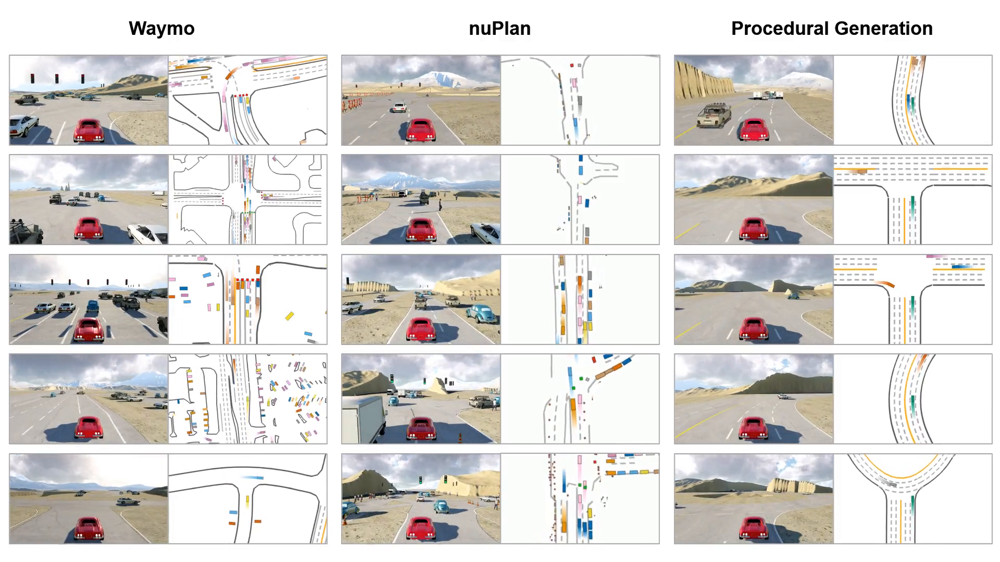

*Image source: frame at 0:03 of [montage.mp4](https://metadriverse.github.io/assets/scenarionet/montage.mp4), the demo video on ScenarioNet's own [project page](https://metadriverse.github.io/scenarionet/) (the README itself only has a system-architecture diagram) — © MetaDriverse, [MIT](third_party_licenses/MIT.txt)*

A dataset-agnostic platform that converts and replays real-world driving logs (Waymo, nuPlan,
nuScenes, Lyft, and more) through the MetaDrive engine.
Citation: Li et al., "ScenarioNet: Open-Source Platform for Large-Scale Traffic Scenario Simulation and
Modeling," NeurIPS 2023 — [github.com/metadriverse/scenarionet](https://github.com/metadriverse/scenarionet)
Simulator license: Apache-2.0

### TrafficBots
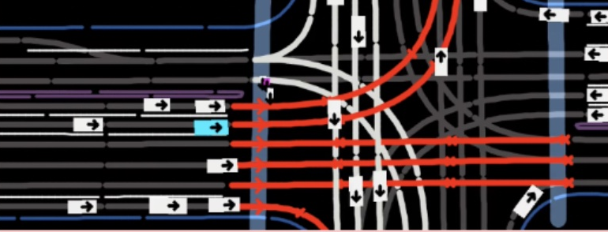

*Image source: cropped from the rendered-scene panel of [trafficbots_banner.jpg](https://raw.githubusercontent.com/zhejz/TrafficBots/main/docs/trafficbots_banner.jpg), TrafficBots' own README banner (its only image; the surrounding diagram/text was cropped out) — © Zhejun Zhang et al., [CC BY-NC 4.0](third_party_licenses/CC-BY-NC-4.0.txt) (non-commercial)*

A learned, personality-conditioned world model that simulates realistic, reactive multi-agent traffic
behavior.
Citation: Zhang et al., "TrafficBots: Towards World Models for Autonomous Driving Simulation and Motion
Prediction," IEEE ICRA 2023 — [github.com/zhejz/TrafficBots](https://github.com/zhejz/TrafficBots)
Simulator license: CC BY-NC 4.0

### BITS
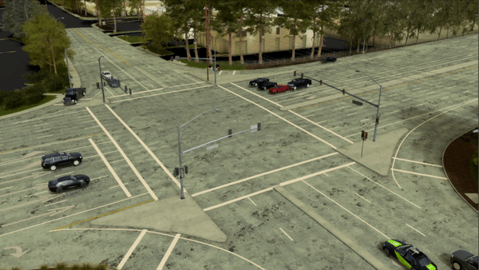

*Image source: [sample_rollout.gif](https://raw.githubusercontent.com/NVlabs/traffic-behavior-simulation/main/assets/sample_rollout.gif), from BITS' own README — © NVIDIA Corporation, [NVIDIA Source Code License-NC](third_party_licenses/NVIDIA-Source-Code-License-NC.txt) (non-commercial)*

A bi-level imitation-learning model for simulating realistic, long-horizon-stable traffic agent
behavior.
Citation: Xu et al., "BITS: Bi-level Imitation for Traffic Simulation," IEEE ICRA 2023
Simulator license: non-commercial NVIDIA license

### InterSim
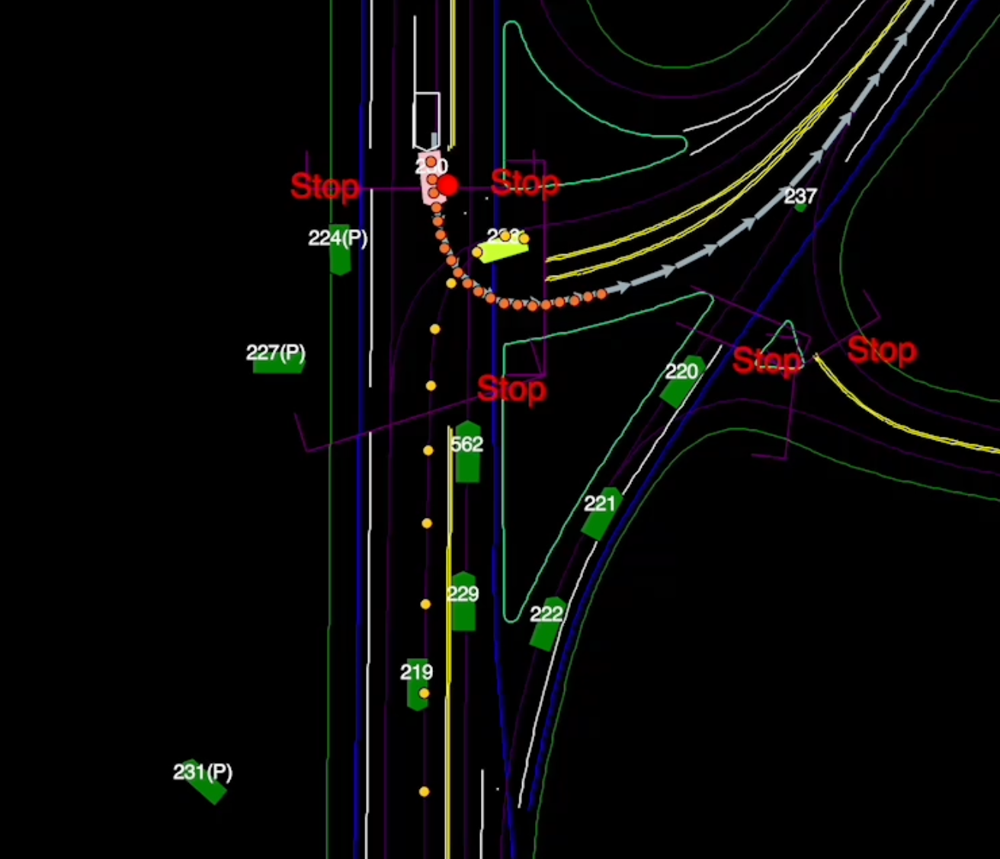

*Image source: [python_vis.png](https://raw.githubusercontent.com/Tsinghua-MARS-Lab/InterSim/main/tutorials/python_vis.png), from InterSim's own README (per-step visualization) — © 2022 Tsinghua MARS Lab, [MIT](third_party_licenses/MIT.txt)*

An interactive traffic simulator that explicitly models how agents' trajectories react to each other
and to the ego vehicle.
Citation: Sun et al., "InterSim: Interactive Traffic Simulation via Explicit Relation Modeling," IEEE
IROS 2022 — [github.com/Tsinghua-MARS-Lab/InterSim](https://github.com/Tsinghua-MARS-Lab/InterSim)
Simulator license: MIT

### VISTA 2.0
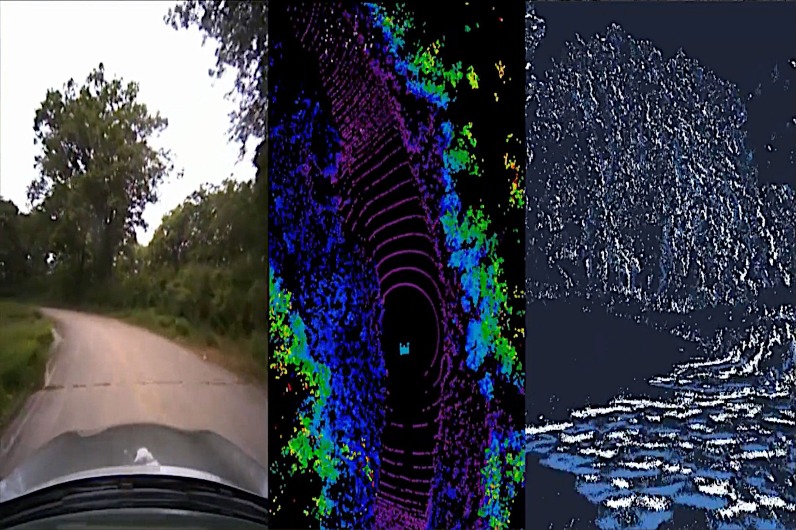

*Image source: [vista2.jpg](https://news.mit.edu/sites/default/files/images/202206/vista2.jpg), from [MIT News' coverage of the VISTA 2.0 release](https://news.mit.edu/2022/researchers-release-open-source-photorealistic-simulator-autonomous-driving-0621) (its GitHub README/docs have no rendered-scene image, only an architecture diagram) — Image courtesy of MIT CSAIL, [CC BY-NC-ND 4.0](third_party_licenses/CC-BY-NC-ND-4.0.txt) per [MIT News terms of use](https://news.mit.edu/terms-of-use)*

A data-driven simulator that synthesizes novel camera, LIDAR, and event-camera viewpoints from
real-world driving logs for photorealistic closed-loop testing.
Citation: Amini et al., "VISTA 2.0: An Open, Data-Driven Simulator for Multimodal Sensing and Policy
Learning for Autonomous Vehicles," IEEE ICRA 2022 — [github.com/vista-simulator/vista](https://github.com/vista-simulator/vista)
Simulator license: MIT

### MILE
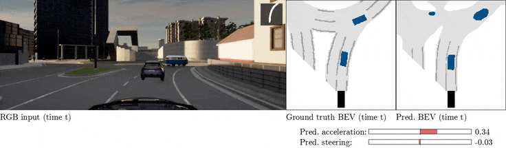

*Image source: [mile_driving_in_imagination.gif](https://github.com/wayveai/mile/releases/download/v1.0/mile_driving_in_imagination.gif), from MILE's [v1.0 GitHub release](https://github.com/wayveai/mile/releases/tag/v1.0) — © 2022 Wayve Technologies Limited, [MIT](third_party_licenses/MIT.txt)*

A model-based imitation-learning agent that learns a driving world model and policy jointly from
expert CARLA driving data.
Citation: Hu et al., "Model-Based Imitation Learning for Urban Driving," NeurIPS 2022 — [github.com/wayveai/mile](https://github.com/wayveai/mile)
Simulator license: MIT

### ReSim
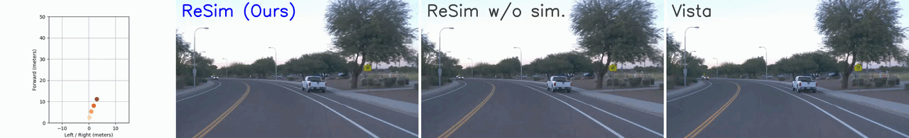

*Image source: [comparison1.gif](https://raw.githubusercontent.com/OpenDriveLab/ReSim/main/assets/comparison1.gif), from ReSim's own README (comparison figure: ReSim vs. ReSim w/o sim. vs. Vista) — © OpenDriveLab, [Apache-2.0](third_party_licenses/Apache-2.0.txt)*

A diffusion-transformer video world model that generates future driving scenes conditioned on action
commands, for reliable long-horizon simulation.
Citation: Yang et al., "ReSim: Reliable World Simulation for Autonomous Driving," NeurIPS 2025 — [github.com/OpenDriveLab/ReSim](https://github.com/OpenDriveLab/ReSim)
Simulator license: code Apache-2.0 (pretrained weights carry a separate, more restrictive license)

## License

Copyright © 2026 Denis Trescher.

The original content of this repository — the text and structure of this README — is licensed under
the [Creative Commons Attribution 4.0 International License](LICENSE) (CC BY 4.0): reuse it however
you like, as long as you credit the author.

The images and GIFs in `images/` are **not** covered by that license. Each belongs to the simulator's
authors and is reproduced here for illustration only, credited on the *Image source* line under it;
their copyright holders, exact sources and individual licenses are listed in
[`THIRD_PARTY_NOTICES.md`](THIRD_PARTY_NOTICES.md), with the license texts in
[`third_party_licenses/`](third_party_licenses/). Several are non-commercial-only — check that file
before reusing any image.
